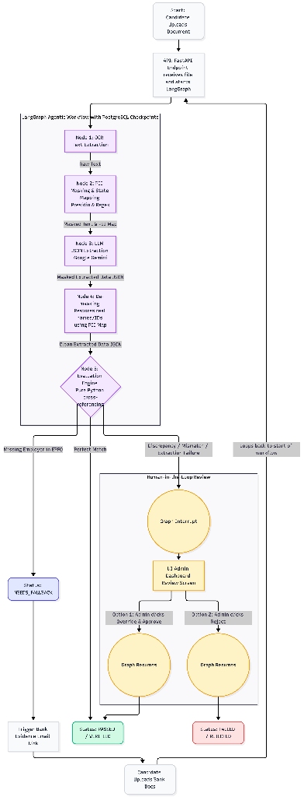

# Aegis HR — Background Verification System

**Developer:** Aarushi Sharma | **Roll No:** 2301010185

An end-to-end agentic BGV pipeline: document upload → OCR → PII masking → LLM extraction → rule-based evaluation → human-in-the-loop review → verified result.

---

## 🏗️ Architecture



```
Upload → OCR (Tesseract + OpenCV)
       → PII Mask (Regex + Presidio) — pii_map in LangGraph state
       → Extract (Google Gemini) — masked text only
       → Evaluate (pure Python rule engine)
       → PASSED → Demask → VERIFIED
          NEEDS_REVIEW → interrupt() → Admin Dashboard → Approve/Reject
          NEEDS_FALLBACK → Admin uploads new evidence
```

## 🛠️ Tech Stack

| Layer | Technology |
|---|---|
| Backend | FastAPI 0.115, Python 3.11+ |
| Agentic workflow | LangGraph 0.4 + AsyncPostgresSaver |
| LLM | Google Gemini (langchain-google-genai) |
| PII masking | Regex + Presidio (no Redis) |
| OCR | Tesseract + OpenCV + pdf2image |
| Database | PostgreSQL 16 (Docker) |
| Frontend | Vite + React 19 + Tailwind CSS v4 |

---

## 🚀 Quick Start

### 1. Prerequisites

```bash
brew install tesseract poppler postgresql  # macOS
# Ubuntu: sudo apt install tesseract-ocr poppler-utils
```

### 2. Start Postgres

```bash
docker compose up -d
```

### 3. Backend

```bash
cd backend
python3 -m venv venv && source venv/bin/activate
pip install -r requirements.txt

# Download Presidio NLP model
python -m spacy download en_core_web_lg

# Copy and fill in your env
cp ../.env.example .env
# Edit .env — set GOOGLE_API_KEY

uvicorn app.main:app --reload
# API: http://localhost:8000
# Docs: http://localhost:8000/docs
```

### 4. Frontend

```bash
cd frontend
npm install
npm run dev
# UI: http://localhost:5173
```

---

## 🧪 Testing Guide (Scenarios)

To fully evaluate the power of the Agentic BGV pipeline, we have provided 4 test cases in the `backend/sample_docs/scenarios/` folder. 

Before testing, log into the frontend using the **Login as Demo HR Admin** button. Create an applicant for each test case at the `/applicants` page (just provide a Name and Email, you can leave "Expected Employer" blank as our agent dynamically extracts it from the CV).

### Test Case 1: The Happy Path (Rahul Mehta)
* **Goal**: Verify a perfect match with no discrepancies.
* **Steps**: 
  1. Upload `case1_cv_clean.png` (Document Type: CV/Resume).
  2. Upload `case1_epfo_clean.png` (Document Type: EPFO History).
* **Expected Result**: The system will automatically extract TCS and Infosys, cross-verify them, and mark the applicant as **VERIFIED**.

### Test Case 2: Hidden Employment (Priya Singh)
* **Goal**: Detect an undisclosed employer (moonlighting).
* **Steps**:
  1. Upload `case2_cv_hidden_emp.png` (Document Type: CV/Resume).
  2. Upload `case2_epfo_hidden_emp.png` (Document Type: EPFO History).
* **Expected Result**: The CV claims HDFC Bank, but the EPFO history reveals concurrent employment at "Tech Mahindra". The system flags this as a Hidden Employment discrepancy and routes the document to the **Review Queue**.

### Test Case 3: The Bank Statement Fallback (Anjali Verma)
* **Goal**: Handle a CV-claimed employer that is completely missing from the EPFO records.
* **Steps**:
  1. Upload `case3_cv_fallback.png` (Document Type: CV/Resume).
  2. Upload `case3_epfo_fallback.png` (Document Type: EPFO History).
  3. The system will fail to find "Wipro" in the EPFO and mark the status as **NEEDS_FALLBACK**.
  4. Upload `case3_bank_statement.png` (Document Type: Bank Statement).
* **Expected Result**: The agent will scan the bank statement, find the salary credits from Wipro, verify the amounts are consistent, and upgrade the document to **VERIFIED**.

### Test Case 4: Name Mismatch (Karan Kumar)
* **Goal**: Detect identity fraud / major name discrepancies.
* **Steps**:
  1. Upload `case4_cv_name_mismatch.png` (Document Type: CV/Resume).
  2. Upload `case4_epfo_name_mismatch.png` (Document Type: EPFO History).
* **Expected Result**: The CV name is "Karan Kumar", but the EPFO name is "Kiran Kumari". The rule engine catches the low fuzzy-match score and flags it as a High-Risk Mismatch in the **Review Queue**.

---

## 📖 API Reference

| Method | Endpoint | Purpose |
|---|---|---|
| `GET` | `/health` | Health check |
| `POST` | `/api/documents/upload` | Upload doc + start pipeline |
| `POST` | `/api/documents/fallback-upload/{id}` | Re-upload evidence |
| `GET` | `/api/admin/review-queue` | All pending reviews |
| `GET` | `/api/admin/review/{thread_id}` | Full state for one review |
| `POST` | `/api/admin/review/{thread_id}/resolve` | Submit admin decision |
| `GET` | `/api/admin/dashboard/stats` | Counts by status |
| `GET` | `/api/admin/applicants` | List applicants |
| `POST` | `/api/admin/applicants` | Create applicant |

---

## 🧠 Key Design Decisions

- **CV-First Architecture**: The CV acts as the baseline "claimed profile", against which government records (EPFO) and financial records (Bank Statements) are dynamically cross-referenced.
- **No Redis**: `pii_map` is stored directly in the LangGraph `VerificationState` TypedDict and persisted to Postgres via `AsyncPostgresSaver`. This eliminates an external dependency.
- **LLM isolation**: Gemini only ever sees masked tokens (e.g. `[MASKED_PERSON_0]`). Real PII is never sent to the model, ensuring enterprise data compliance.
- **Graceful Fallbacks**: If PII masking fails for any reason, the pipeline safely continues with raw text. If the LLM rate limit is hit, the pipeline safely routes the document to human review instead of crashing.
- **Pure Python evaluation**: The cross-document rule engine uses no LLM calls—it is fully deterministic, fast, and unit-testable.
